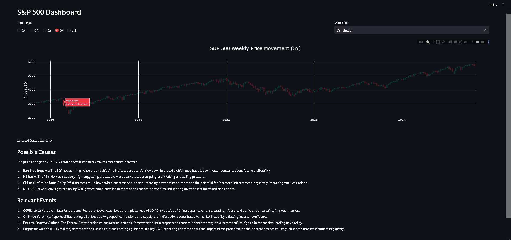

# S&P 500 Visualization with ChatGPT Insights

## Project Overview

This dashboard provides an interactive way to visualize and analyze the S&P 500 index across different timeframes. Built
with Python, Streamlit, and Plotly, it combines market data with ChatGPT-generated insights to explain price movements
in context.

By integrating macroeconomic indicators and historical events, the tool helps users explore the underlying factors
behind market performance, including economic trends, policy changes, and major news events.

### S&P 500 during Covid

## Key Features

**Data Visualization**  
Supports candlestick, line, bar, and table views for flexible analysis.

**Dynamic Filters**  
Allows selection of timeframes such as 1 month, 1 year, 5 years, or the full dataset.

**Interactive Insights**  
Clicking on a date displays AI-generated analysis of possible causes and relevant events.

**Categorized Weekly Changes**
Weekly percentage changes are grouped into bins such as Significant Increase or Extreme Decrease for quick pattern
recognition.

## Advanced Analysis

- Performed exploratory data analysis (EDA) to determine optimal bin thresholds for categorizing weekly percentage
  changes.
- Applied custom color coding to highlight patterns in price movements.
- Incorporated macroeconomic data including CPI, GDP, inflation rates, and corporate earnings to provide additional
  context.

## Technical Details

**Data Sources**  
Macroeconomic data was scraped from multpl.com. Historical S&P 500 prices were retrieved using the Yahoo Finance API.

**Data Processing**  
Data was cleaned, structured into Pandas DataFrames, and merged into two master datasets: one for macroeconomic
indicators and one for market data.

**AI Integration**  
Processed data was passed into the ChatGPT API using a structured prompt to return two sections:

1. Possible Causes: macroeconomic factors influencing price changes
2. Relevant Events: notable non-financial events or news stories that may have affected the market

**Optimization**  
Streamlit’s caching was used to improve performance. The `plotly_events` function captured user interactions, enabling
dynamic insights when a date was selected.

## Impact and Future Scope

The dashboard offers value to investors, analysts, and researchers by helping them:

- Understand historical drivers of market movements
- Connect macroeconomic changes and real-world events to price fluctuations
- Interactively explore trends for better decision-making

Planned future developments include expanding coverage to other indices and stocks, and adding predictive modeling for
forward-looking analysis.

## Credits

This project was developed as a part of the Data Analytics program at Langara College.
It was a collaborative effort, and I’d like to acknowledge my amazing teammates for their contributions:

- [Roman Shrestha](https://github.com/RomanShrestha07)
- [Aryan Mukherjee](https://github.com/Aryan12042001)
- [Maryam Gadimova](https://github.com/MaryamGadimova)
- [Patricia Tating](https://github.com/patricia-tating)
- [Bemba Munkhchuluun](https://github.com/Bembaa)